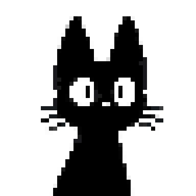

<div align="center">


</div>

---

<table align="center" border="0" cellspacing="0" cellpadding="0">
<tr>
<td width="55%" valign="top">

## 🧑‍💻 Quién soy

Tengo 22 años, vivo en Argentina y estoy a **un paso de graduarme** en la Tecnicatura de Programación de la UTN. Desarrollé proyectos reales durante la carrera usando tecnologías modernas tanto en el backend como en el frontend.

Me apasiona entender cómo funcionan las cosas por dentro, escribir código limpio y seguir creciendo — hay demasiado para aprender y eso me entusiasma.

Actualmente busco mi **primera experiencia profesional** donde pueda aportar y seguir aprendiendo junto a un equipo.

> 🐈‍⓿ Este es mi compañero de debugging. Él supervisa cada commit.

</td>
<td width="10%"></td>
<td width="35%" valign="top" align="center">



<br/>
<sub><b>🐾 El verdadero senior developer</b></sub>

</td>
</tr>
</table>

---

## ⚡ Mi stack

<details open>
<summary><b>🔵 Lenguajes</b></summary>
<br/>


</details>

<details open>
<summary><b>🟣 Backend</b></summary>
<br/>


REST APIs · JWT Auth · CORS · DTOs · Arquitectura Modular · MVC

</details>

<details open>
<summary><b>🟢 Frontend</b></summary>
<br/>


Vue Router · Responsive Design · Consumo de APIs externas

</details>

<details open>
<summary><b>🗄️ Bases de datos</b></summary>
<br/>


</details>

<details>
<summary><b>🔧 Herramientas</b></summary>
<br/>


</details>

---

## 📊 Stats

<div align="center">


</div>

---

## 🌱 Actualmente

```text
🎓  Finalizando la Tecnicatura en UTN  ████████████████████░  99%
📚  Aprendiendo mejores prácticas y patrones de diseño
🔍  Buscando mi primera experiencia profesional
🐈‍⓿  Siendo supervisado por un gato negro muy exigente
```

---

## 📬 Contacto

<div align="left">

[](mailto:uaimar75@gmail.com)
[](https://instagram.com/ulises_aimar)

</div>

---

<div align="center">


 🐾 🐾 🐾 🐾 🐾

</div>

